<p align="center"></p>

<p align="center"><b>A fast local image generator for low-end GPUs.</b><br>
Its own C++/CUDA inference engine and web UI, built from scratch for cards like the GTX 16xx.</p>

---

Kiln runs diffusion models on its own engine instead of PyTorch. The kernels are written for GPUs
without tensor cores: fp16x2 (HFMA2) GEMMs and implicit-GEMM convolutions, a fused flash attention,
and weights kept in their checkpoint precision. On a laptop GTX 1660 Ti Max-Q (6 GB, power-capped),
it renders the same seeds several times faster than PyTorch-based UIs.

| Anima, 512x768, turbo LoRA, 8 steps | Time |
|---|---|
| ComfyUI (same seed, same card) | ~99 s |
| Kiln | ~12 s |
| Kiln + face detailer + hires fix | ~40 s |

> **Model support: Anima only, for now.** Kiln currently runs the Anima model (and Anima checkpoints and
> LoRAs). SDXL (Illustrious, NoobAI, Pony) is in progress and turned off in the UI.

**[Download the latest release](https://github.com/sonsegajp/kiln/releases/latest)** (`Kiln.zip`), unzip
it, and run `setup.bat`. See [Install](#install).

<p align="center">
  
  
  
  
</p>

## Features

- **Simple mode**: an A1111-style layout (txt2img, img2img with inpainting, Extras, PNG Info), with live
  step previews and per-stage progress for sampling, face refining, hires fix and upscaling.
- **Nodes mode**: a node editor that runs graphs natively on the engine and imports ComfyUI workflows
  (API or UI JSON, or a PNG) built from the nodes Kiln implements.
- **Packs**: Kiln's own extension API (`docs/NODE_API.md`). JavaScript nodes run in the server and call
  the engine for GPU work. Install packs from git or a folder, or scaffold a new one in the Extensions
  panel. Three example packs are bundled.
- **CivitAI browser**: search and download checkpoints and LoRAs (API key supported). Downloads are
  resumable and hash-verified.
- **LoRA slots** plus `<lora:name:weight>` prompt syntax, and A1111/ComfyUI prompt weighting.
- **Negative prompts at CFG 1** through NAG (Normalized Attention Guidance).
- **Built-in post-processing**: a YOLOv8 face detailer, hires fix and a 4x RRDB upscaler (4x-AnimeSharp).
- **Characters (Animadex)**: search ~36,000 characters the Anima model knows (from
  [animadex.net](https://animadex.net/)) and add a character's tags to the prompt with one tap: their
  name, their look and, optionally, their usual outfit.
- **Samplers and schedulers**: euler, euler ancestral, DPM++ 2M, res multistep and ER SDE, with every
  ComfyUI scheduler. The first-block step cache is optional.
- **Low-VRAM friendly**: weights that don't fit in VRAM stream from system RAM, VAE decodes are
  banded, and the scratch memory regrows automatically.
- **Phones and tablets**: the web UI works on phones and tablets on the same Wi-Fi.

**Models**: **Anima only, for now** (Cosmos-Predict2 2B with the Qwen3-0.6B text encoder and the
Qwen-Image VAE; Anima-based checkpoints and LoRAs work too). SDXL (Illustrious, NoobAI, Pony) already
renders in the engine but is turned off in the UI until it's fast enough on low-end cards.

## Screenshots

| | |
|---|---|
| 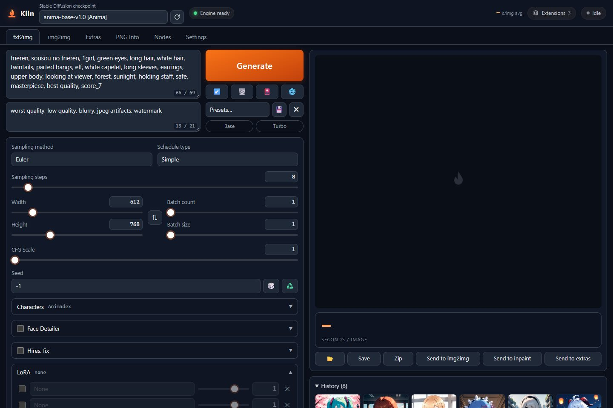 txt2img | 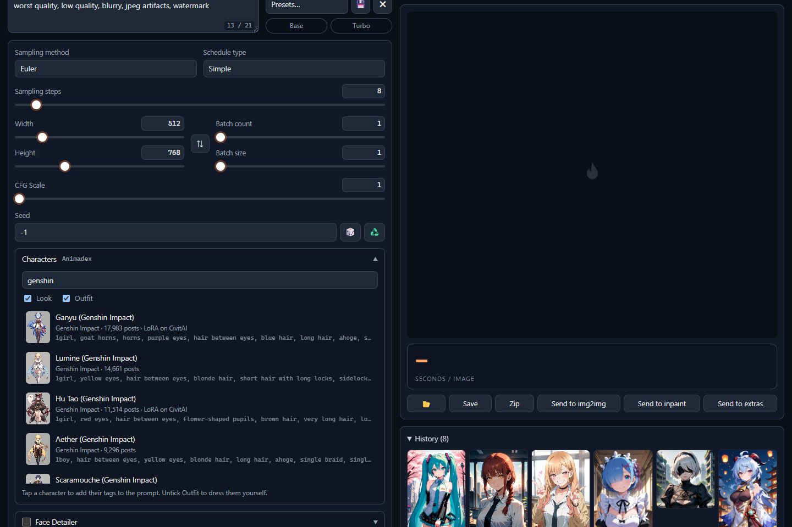 Characters (Animadex) |
| 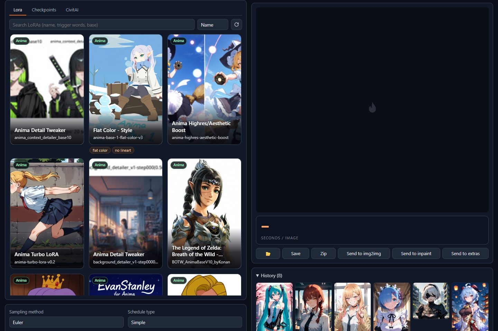 LoRA cards | 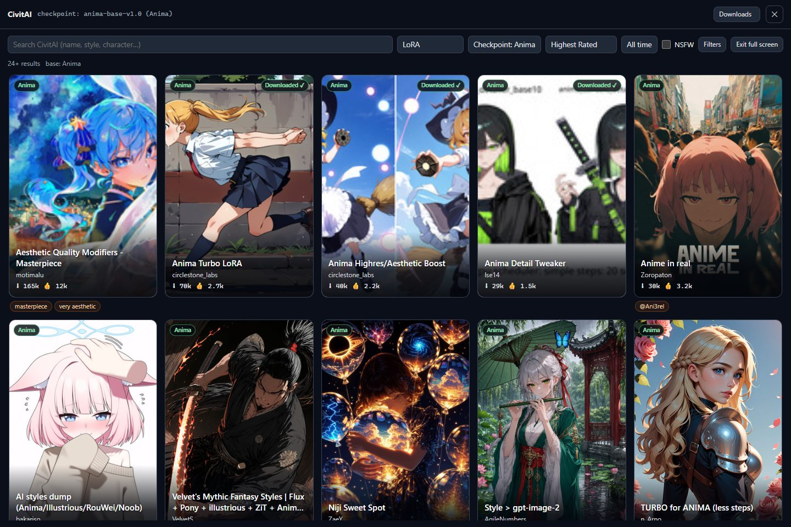 CivitAI browser |
| 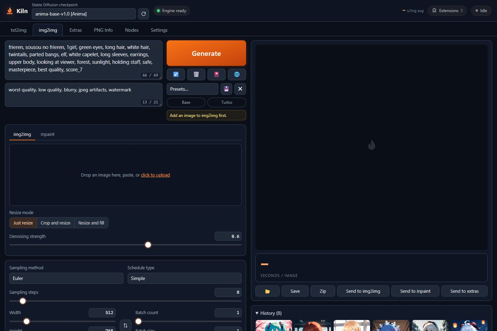 img2img and inpainting | 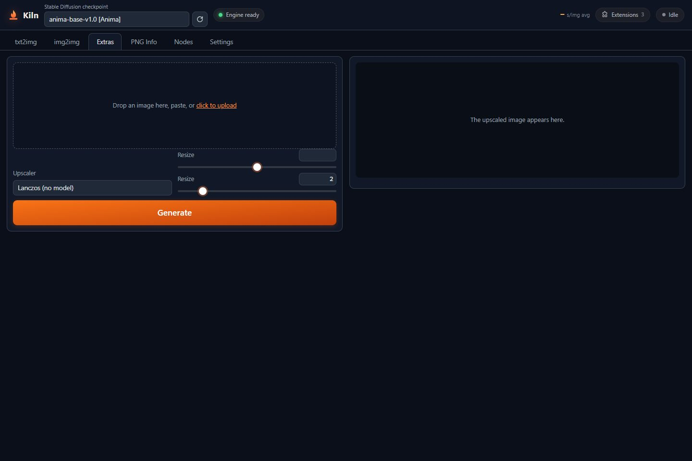 Extras (upscaling) |
| 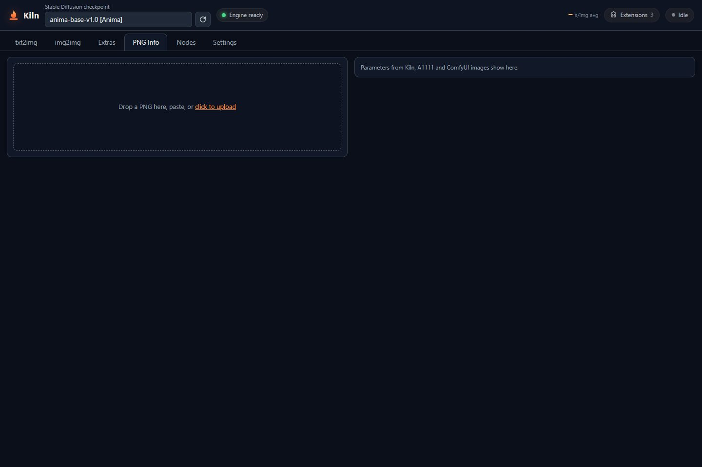 PNG Info | 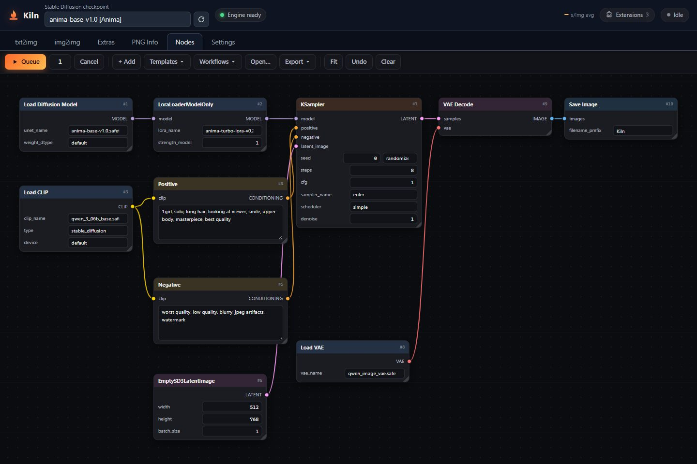 Nodes |
| 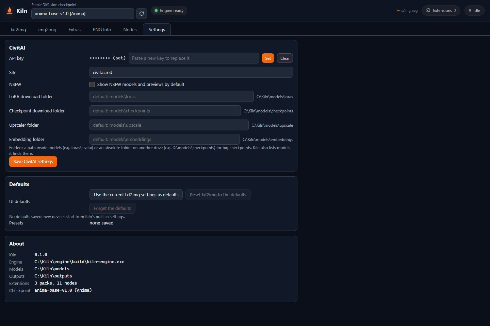 Settings | 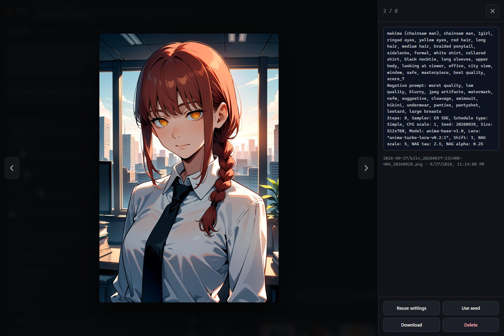 Image viewer with generation parameters |

## Benchmarks

Measured on a **laptop NVIDIA GeForce GTX 1660 Ti with Max-Q Design (6 GB)** with the stock setup
(`setup.bat`: Anima base + turbo LoRA), NAG on (the default), engine warm. Times are the whole job:
prompt encoding, sampling, face/hires passes and the VAE decode.

| Render | Sampling | Time | Per step |
|---|---|---|---|
| 512×768, 8 steps, turbo LoRA | Euler | **12.0 s** | 1.41 s |
| 512×768, 8 steps, turbo LoRA | ER SDE | 12.2 s | 1.43 s |
| 512×768, 8 steps + Face Detailer (4 steps) | Euler | 17.3 s | 1.43 s |
| 512×768 → Hires fix 1.5× to 768×1152 (8 + 4 steps) | Euler | 28.4 s | 1.44 s |
| 768×1152, 8 steps, turbo LoRA | Euler | 30.2 s | 3.61 s |
| 1024×1024, 8 steps, turbo LoRA | Euler | 38.0 s | 4.54 s |
| 512×768, 20 steps, CFG 4.5, no turbo LoRA | DPM++ 2M | 52.2 s | 2.56 s |

Starting Kiln loads the engine in about 12 s; the first render after that also loads its LoRAs.

### Render time by resolution

The same prompt and seed (Frieren, from the Characters panel) rendered at eight sizes: Anima + turbo LoRA,
8 steps, Euler, NAG on. Time grows a little faster than the pixel count, because self-attention's cost
grows with the square of the number of image tokens.

<picture>
  <source media="(prefers-color-scheme: dark)" srcset="docs/img/bench_res_dark.svg">
  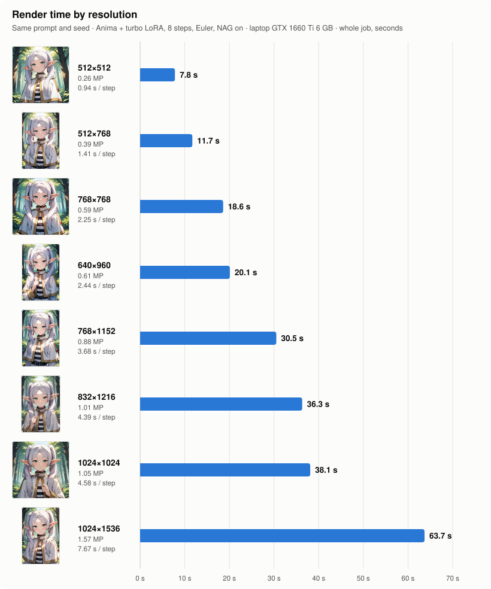
</picture>

| Size | Pixels | Time | Per step | Render |
|---|---|---|---|---|
| 512×512 | 0.26 MP | **7.8 s** | 0.94 s | [view](docs/img/res/frieren_512x512.jpg) |
| 512×768 | 0.39 MP | **11.7 s** | 1.41 s | [view](docs/img/res/frieren_512x768.jpg) |
| 768×768 | 0.59 MP | **18.6 s** | 2.25 s | [view](docs/img/res/frieren_768x768.jpg) |
| 640×960 | 0.61 MP | **20.1 s** | 2.44 s | [view](docs/img/res/frieren_640x960.jpg) |
| 768×1152 | 0.88 MP | **30.5 s** | 3.68 s | [view](docs/img/res/frieren_768x1152.jpg) |
| 832×1216 | 1.01 MP | **36.3 s** | 4.39 s | [view](docs/img/res/frieren_832x1216.jpg) |
| 1024×1024 | 1.05 MP | **38.1 s** | 4.58 s | [view](docs/img/res/frieren_1024x1024.jpg) |
| 1024×1536 | 1.57 MP | **63.7 s** | 7.67 s | [view](docs/img/res/frieren_1024x1536.jpg) |

More renders from the benchmark runs above, with characters added from the Characters panel:

<p align="center">
  
  
  
</p>

## Requirements

- Windows 10 (version 1803 or newer) or Windows 11.
- An NVIDIA GPU, Turing (GTX 16xx / RTX 20xx) or newer, with driver **580 or newer** (Kiln uses CUDA 13).
  6 GB of VRAM is recommended; smaller cards work, with weights streamed from system RAM.
- About 7 GB of free disk space for the engine and models, plus room for your renders.

Nothing else needs to be installed beforehand: `setup.bat` fetches Node.js if you don't have it.

## Install

1. **Download `Kiln.zip`** from the [latest release](https://github.com/sonsegajp/kiln/releases/latest) and
   unpack it anywhere (paths with spaces are fine). It already holds the engine, so no git, account or
   compiler is needed. (Developers can `git clone https://github.com/sonsegajp/kiln.git` instead;
   `tools\make-dist.js` builds the zip.)

2. **Run `setup.bat`** (double-click it). It asks what to get: everything that's missing (the default),
   only the prerequisites, or parts you pick. Anything already on the PC is skipped: an installed Node.js
   20+, an installed CUDA 13 toolkit's cuBLAS, and model files already in `models\` or in a ComfyUI
   `models` folder (found in the usual places, or pass `--from <folder>`). It can download, into the Kiln folder:

   | What | From | Size |
   |---|---|---|
   | Node.js 24 (portable), only if Node.js 20+ isn't installed | nodejs.org | 35 MB |
   | The engine, `kiln-engine.exe` (only if it's missing from the zip) | this repository's releases | 7 MB |
   | NVIDIA cuBLAS runtime DLLs | NVIDIA's CUDA redistributables | 420 MB download |
   | Anima base model, Qwen3 0.6B text encoder, Qwen-Image VAE | [circlestone-labs/Anima](https://huggingface.co/circlestone-labs/Anima) | 5.6 GB |
   | Anima turbo LoRA (8-step renders) | [circlestone-labs/Anima-Official-LoRAs](https://huggingface.co/circlestone-labs/Anima-Official-LoRAs) | 150 MB |
   | 4x-AnimeSharp upscaler | [Kim2091/AnimeSharp](https://huggingface.co/Kim2091/AnimeSharp) | 33 MB |
   | YOLOv8 face detector (converted for the engine on your PC) | [Bingsu/adetailer](https://huggingface.co/Bingsu/adetailer) | 52 MB |

   Every download is pinned to a SHA256 and resumes if it's interrupted, so if anything fails, just run
   `setup.bat` again. Finished steps are skipped. Options:

   | Command | Does |
   |---|---|
   | `setup.bat all` | everything that's missing, no questions |
   | `setup.bat prereqs` | only what Kiln needs to run: the engine and NVIDIA's cuBLAS |
   | `setup.bat models` | only the models |
   | `setup.bat anima te vae turbo upscaler face engine cublas` | just the parts named |
   | `setup.bat --list` | each part: installed or not, size, download link and the folder it goes in (to download by hand) |
   | `setup.bat --from "D:\ComfyUI\models"` | reuse model files you already have: linked or copied instead of downloaded |
   | `setup.bat --no-extras` | skips the upscaler and the face detector |
   | `setup.bat --verify` | re-checks the hashes of model files that are already there |
   | `setup.bat --build` | builds the engine from source instead of downloading it (see below) |

   None of these downloads need an account or a login.

3. **Run `start.bat`** and open **http://localhost:8090/**. The console window is the server; close it
   to stop Kiln. The first render after starting takes longer while the models load.

## Using Kiln

### Your first image

1. In **txt2img**, click the **Turbo** preset next to the prompt box (turbo LoRA at 1.0, 8 steps, CFG 1,
   Euler). **Base** is the slower, full-quality alternative: 20 steps, CFG 4.5, DPM++ 2M.
2. Type a prompt. Anima works well with Danbooru-style tags, natural language, or both. A negative prompt
   still applies at CFG 1 through NAG.
3. Pick a size (512x768 is a good start on 6 GB) and press **Generate**. The bars show each stage's
   progress, with a live preview while it samples.

Renders are saved as PNGs in `outputs\<date>\`, with the generation settings embedded. Drop one on
**PNG Info** to read them back, or send them on to img2img, Extras or Nodes.

### Better results

- **Face Detailer** finds faces with the YOLOv8 detector and re-renders each one at higher resolution.
  It runs before hires fix, so the hires pass refines the new faces along with the rest of the image.
- **Hires. fix** renders small and then refines at a larger size. The **4x-AnimeSharp (model)** upscaler
  gives sharper lines than Lanczos.
- **Extras** upscales any image with 4x-AnimeSharp.
- **img2img** reworks an existing image. Its **Inpaint** tab repaints only the area you mask.

### LoRAs

Put LoRA `.safetensors` files in `models\loras\`, or download them with the CivitAI browser. Enable
them in the LoRA slots under the prompt, or write `<lora:name:0.8>` in the prompt. Anima LoRAs only
work with Anima checkpoints.

### CivitAI

Open **Settings → CivitAI** and paste an API key (civitai.com → Account settings → API keys). Some
models can only be downloaded with a key. The key is stored on your PC in `config\civitai.json`. It is
never sent to the browser, and it can only be changed from the PC running Kiln.

Browse with the 🌐 button or the **CivitAI** tab next to Lora and Checkpoints. Results are filtered to
the base model of the checkpoint you have selected (Anima, Illustrious, and so on). Downloads land in
`models\loras\` or `models\checkpoints\` with their preview images, and are hash-checked.

### Nodes and packs

**Nodes** is a node editor for building your own pipelines. Drop in a ComfyUI workflow (API or UI JSON,
or a PNG that carries one) to import it. The nodes Kiln implements run natively on the engine.

The **Extensions** button manages packs: installing them from a git URL or a folder, enabling or
disabling them, and scaffolding new ones. A pack is JavaScript that runs inside the Kiln server, so only
install packs you trust. To write one, see [`docs/NODE_API.md`](docs/NODE_API.md).

### Phones and tablets

The server prints LAN addresses when it starts (for example `http://192.168.1.20:8090/`). Open one on
any device on the same network to generate from there. Settings and extensions can only be changed on
the PC itself. If Windows asks whether Node.js may use the network, allow private networks.

## Folders

| Folder | Holds |
|---|---|
| `models\` | the Anima base model, text encoder, VAE and turbo LoRA |
| `models\loras\` | LoRAs |
| `models\checkpoints\` | other checkpoints (SDXL checkpoints are listed but can't run yet) |
| `models\upscale\` | upscaler models |
| `models\detect\` | the face detector |
| `outputs\` | your renders, one folder per day |
| `inputs\` | images uploaded for img2img, inpainting and Extras |
| `workflows\` | node workflows you've saved |
| `config\` | settings and your CivitAI key |
| `extensions\` | installed packs |

None of these are tracked by git except the bundled example packs, so updating never touches your
models, renders or key.

## Settings

The server reads these environment variables. Set them in a terminal before running `start.bat`, e.g.
`set KILN_PORT=8091`.

| Variable | Default | What |
|---|---|---|
| `KILN_PORT` | `8090` | web server port |
| `KILN_HOST` | `0.0.0.0` | listen address; `127.0.0.1` keeps Kiln off your network |
| `KILN_MODELS` | `models` | models folder (`setup.bat` downloads there too) |
| `KILN_OUTPUTS` | `outputs` | where renders are saved |
| `KILN_INPUTS` | `inputs` | uploaded images |
| `KILN_WORKFLOWS` | `workflows` | saved node workflows |
| `KILN_CONFIG` | `config` | settings and the CivitAI key |
| `KILN_EXTENSIONS` | `extensions` | packs folder |
| `KILN_EXT_LAN` | off | `1` allows managing packs from other devices |
| `KILN_ENGINE` | `engine\build\kiln-engine.exe` | engine executable |
| `KILN_SDXL` | off | `1` enables the unfinished SDXL path (slow) |

## Updating

```
git pull
setup.bat
```

`setup.bat` fetches anything new that the update needs. To get a newer engine as well, delete
`engine\build\kiln-engine.exe` before running it, or use `setup.bat --build`.

## Troubleshooting

- **The engine exits right away or reports a CUDA error.** Update the NVIDIA driver to 580 or newer.
  `setup.bat` prints your GPU and driver at the top.
- **Out of memory.** Close other programs that use the GPU (games, browsers with hardware
  acceleration, other AI tools), render smaller, or turn off hires fix. Weights that don't fit in VRAM
  stream from system RAM automatically, which is slower.
- **"Port 8090 is in use."** Another program, or another Kiln, is using the port. Close it or set
  `KILN_PORT`.
- **A download failed or was interrupted.** Run `setup.bat` again; it resumes.
- **Something looks corrupted.** Run `setup.bat --verify`. Files that fail the check are downloaded again.
- **The face detailer or the model upscaler is unavailable.** Its model is missing; run `setup.bat`
  (without `--no-extras`). The note under the option says what's missing.

## Under the hood

This section explains how Kiln works, from the button press to the saved PNG. File names point at the
code that does each part.

- [The three parts](#the-three-parts)
- [One render, step by step](#one-render-step-by-step)
- [The engine protocol](#the-engine-protocol)
- [The Anima model](#the-anima-model)
- [Prompts and tokenizers](#prompts-and-tokenizers)
- [GPU kernels](#gpu-kernels)
- [Memory: VRAM, system RAM and streaming](#memory-vram-system-ram-and-streaming)
- [Sampling](#sampling)
- [NAG: negative prompts at CFG 1](#nag-negative-prompts-at-cfg-1)
- [LoRAs](#loras-1)
- [Face Detailer](#face-detailer)
- [Hires fix, upscaling and the VAE](#hires-fix-upscaling-and-the-vae)
- [Accuracy and reproducibility](#accuracy-and-reproducibility)
- [The server](#the-server)
- [Characters (Animadex)](#characters-animadex)
- [CivitAI](#civitai-1)
- [Nodes and packs](#nodes-and-packs-1)
- [Sharing the GPU with other apps](#sharing-the-gpu-with-other-apps)
- [Setup and the release zip](#setup-and-the-release-zip)

### The three parts

| Part | What it is | Where |
|---|---|---|
| **Web UI** | Plain HTML, CSS and JavaScript with no build step and no framework. The Simple mode (txt2img, img2img, Extras, PNG Info), the node editor, the LoRA and CivitAI browsers, the gallery and the viewer. | `web/` |
| **Server** | Node.js with zero npm dependencies. It serves the UI, turns prompts into token ids, queues jobs, supervises the engine, writes the PNGs, and runs the gallery, CivitAI, Animadex and packs. | `server/` |
| **Engine** | `kiln-engine.exe`: about 10,000 lines of C++ and CUDA. It loads the models and does all the GPU work. There's no PyTorch, no Python and no ONNX. The only outside library is NVIDIA's cuBLAS, used for the fp32 fallback paths. | `engine/src/` |

The server starts the engine as a child process and talks to it over its stdin and stdout.

### One render, step by step

1. **The browser** posts the settings to `POST /api/generate`.
2. **The server** (`server/server.js`) checks the request. It:
   - clamps sizes to multiples of 16;
   - takes `<lora:name:weight>` tags out of the prompt and resolves them to files;
   - converts A1111 `[text]` de-emphasis to ComfyUI weights (`server/lib/a1111.js`);
   - picks a random seed if needed;
   - drops post-processing whose model is missing, and reports what it dropped.
3. **The server tokenizes** the prompt and the negative prompt twice (`server/lib/tokenize.js`):
   - Qwen2 byte-level BPE ids for the text encoder;
   - T5 unigram ids plus a weight per token for the adapter.
4. **The job is queued.** Jobs run one at a time, because there is one GPU. When the job's turn comes, the
   server writes one JSON line to the engine's stdin.
5. **The engine** (`engine/src/engine.h`, `Engine::generate`):
   1. swaps in the job's Anima checkpoint if it differs from the loaded one;
   2. takes back VRAM that another app has since freed;
   3. attaches the LoRAs;
   4. encodes the prompts, or reuses a cached encoding;
   5. samples;
   6. decodes with the VAE;
   7. runs the face detailer, the hires fix and the upscaler if they're enabled;
   8. writes the raw 8-bit RGB to a temporary file and reports `done`.

   While it samples, it streams a step event with a small preview after every step.
6. **The server** encodes the PNG and embeds the settings. It builds the thumbnails and sends the finished
   job to every open page over Server-Sent Events.

### The engine protocol

One JSON object per line in each direction (`engine/src/main.cpp`). A stdin reader thread takes
requests, and one worker thread runs jobs from a queue. `cancel` stops the running job between steps, or
removes a queued one.

A request (shortened):

```json
{"cmd":"generate","id":"j12","width":512,"height":768,"steps":8,"cfg":1,"sampler":"euler",
 "scheduler":"simple","shift":3,"seed":777,"qwen_ids":[...],"t5_ids":[...],"t5_weights":[...],
 "neg":{"qwen_ids":[...],"t5_ids":[...],"t5_weights":[...]},
 "nag":{"enabled":true,"scale":5,"tau":2.5,"alpha":0.25},
 "loras":[{"file":"...\\anima-turbo-lora-v0.2.safetensors","strength":1}],
 "face":{"enabled":true,"steps":4,"denoise":0.4},"hires":{"scale":1.5,"steps":4,"denoise":0.4},
 "out":"...\\outputs\\tmp\\j12.rgb"}
```

| Commands (stdin) | |
|---|---|
| `generate` | a Simple-mode render (all the fields above) |
| `graph` | a node graph ([`docs/GRAPH_PROTOCOL.md`](docs/GRAPH_PROTOCOL.md)) |
| `cancel` | stop job `id` |
| `info` | GPU name, free VRAM, scratch size, loaded model family |
| `ext_result`, `ext_op` | replies to a pack node that a running graph is waiting on |

| Events (stdout) | |
|---|---|
| `ready`, `fatal` | the engine is up; or it failed to start, with the reason |
| `loading` | which model is being loaded (`vae`, `dit`, `te`, `face`, `upscale`, `model`) |
| `encoded` | prompt encoding time |
| `step` | stage (`base`, `face`, `hires`), step, of, ms, and a base64 RGB preview at latent size |
| `decoded` | VAE decode time |
| `done` | output file, final size, total ms and a per-stage timing breakdown (including the scratch peak) |
| `error`, `cancelled` | the job ended early |
| `log` | free-form log lines, shown in the server console |

The server's supervisor (`server/lib/engine.js`) restarts a crashed engine with a backoff: 0.5 s, doubling
up to 15 s, reset after a minute of uptime. A job that was running when the engine died fails with an
error instead of hanging. Without `kiln-engine.exe`, the server runs `server/mock-engine.js`, which speaks
the same protocol, so the UI can be worked on without a GPU. It switches to the real engine as soon as the
exe appears.

### The Anima model

Anima is three networks. The engine has its own implementation of each (`te.cu`, `dit.cu`, `vae.cu`).

- **Text encoder: Qwen3-0.6B** (`te.cu`)
  - 28 layers, grouped-query attention (16 query heads, 8 key/value heads, head size 128), q/k RMSNorm,
    RoPE with θ = 10⁶.
  - The engine keeps the final-norm hidden states, `[tokens, 1024]`.
  - It always runs in exact fp32: Qwen's residual stream reaches the thousands, which would overflow fp16
    GEMM inputs. It is a tiny share of the work anyway.
- **LLM adapter**: 6 transformer blocks, width 1024, 16 heads of 64 (`Dit::adapt`).
  - It embeds the T5 token ids.
  - Each block runs self-attention (with RoPE), then cross-attention onto the Qwen states, then an MLP.
  - An output projection and an RMSNorm come next. Then each row is multiplied by its token's prompt
    weight (this is how `(word:1.3)` works).
  - The rows are zero-padded to at least 512, as ComfyUI does. This is the DiT's cross-attention context.
  - It runs once per prompt in fp32.
- **DiT: Cosmos-Predict2 MiniTrainDIT, 2B parameters** (`dit.cu`)
  - 28 blocks, width 2048, 16 heads of 128, and a GELU MLP of width 8192.
  - The latent (16 channels plus a padding-mask channel) is cut into 2×2 patches, so one token covers
    16×16 pixels. A 512×768 image is 1,536 tokens.
  - Each block runs self-attention with Cosmos's 3D RoPE (22 temporal, 21 height and 21 width
    frequencies; NTK-scaled for height and width), then cross-attention to the context, then the MLP.
  - Each of the three has a LayerNorm modulated by the timestep (adaLN-LoRA) and a gated residual.
  - The output is the flow velocity.
  - Latents with odd sizes are padded circularly to the patch grid and cropped back, like ComfyUI.
- **VAE: the Wan2.1 / Qwen-Image VAE** (`vae.cu`)
  - 16 latent channels, 8× smaller than the image on each side.
  - It is a video VAE. For a single frame, every causal 3D convolution reduces to a 2D convolution with
    its last temporal tap, and the temporal up- and downsamplers are skipped. So the engine loads only
    those taps.
  - Latents are converted between the VAE's space and the model's space with Wan2.1's per-channel
    normalization.

SDXL (UNet, CLIP-L and CLIP-G, SDXL VAE: `sdxl.cu`, `clip.cu`, `sdvae.cu`) is implemented as well. It's
off in the UI until it's fast enough on these cards.

### Prompts and tokenizers

The server's tokenizers are exact JavaScript ports, with no Python and no `tokenizers` library:

- **Qwen2 tokenizer**: byte-level BPE, NFC normalization, the Qwen2 pre-tokenizer regex, and added-token
  splitting (leftmost-longest, as Hugging Face does).
- **T5 tokenizer**: read from `tokenizer.json`. The precompiled-charsmap normalizer, right strip, runs of
  spaces to `▁`, Metaspace, and Unigram Viterbi segmentation.
- **Prompt weighting**: ComfyUI's rules (`escape_important`, nested `( )` at ×1.1 per level, `(text:1.3)`,
  `\(` escapes), as ComfyUI's Anima text encoder applies them. The weights ride on the T5 tokens and scale
  the adapter's output rows.

`POST /api/tokenize` shows the ids and weights for any prompt. The vocabularies ship in
`server/tokenizers/`.

### GPU kernels

GTX 16xx cards (Turing TU116/TU117) have no tensor cores. They do run **fp16x2 (HFMA2)** instructions at
twice their fp32 rate: one instruction does two fp16 multiply-adds. PyTorch doesn't take advantage of
that on these cards. Kiln's kernels are built around it.

- **Precision layout**: activations are stored in fp32. Weights stay in the checkpoint's own bf16, 2 bytes
  per parameter; they are never expanded to fp32 in memory. Operands are rounded to fp16 only inside the
  kernels, right before the multiply.
- **GEMM** (`hgemm.cuh`), `C = A·Wᵀ`, used for every linear layer:
  - 128×128 output tiles and 16-deep k tiles.
  - The fp32 activations and bf16 weights are both converted to fp16 while being staged into shared
    memory, so there is no separate conversion pass. A is stored as duplicated `(a, a)` half2 pairs, so
    the inner loop is only shared-memory loads and HFMA2.
  - Products accumulate in fp16 pairs and are **flushed into fp32 accumulators every 32 k**. That keeps
    the long reductions (K = 2048 to 8192) accurate.
  - Shapes the kernel can't take (N not a multiple of 128, or K not a multiple of 16) fall back to a
    weight converted to fp32 and cuBLAS SGEMM.
- **Flash attention** (`flash.cuh`), head size 128:
  - A thread block takes 64 queries of one head. Keys and values stream through shared memory 64 at a
    time with an online softmax, so the score matrix never exists in memory.
  - Both matmuls (QKᵀ and PV) run as HFMA2, with operands paired along the dimension being summed. Every
    instruction does two useful multiply-adds, with no register shuffles. Q is pre-scaled by log₂e/√d, so
    the softmax runs in base 2. Partial sums stay short (16 to 32 products per fp16 lane) before they are
    flushed into fp32.
  - The context's all-zero padding keys are handled analytically: they add `npad·exp(−max)` to the
    softmax denominator and nothing to the output. Padding the prompt to 512 therefore costs nothing.
- **Convolutions** (`vaeconv.cuh`) are implicit GEMMs.
  - The im2col matrix is gathered on the fly into shared memory and never materialized. Every 16-deep k
    tile is 16 channels of one tap, so the gather needs one bounds check per tap.
  - The modes are 3×3, 1×1, and stride 2. The decoder's nearest-2× upsample followed by a 3×3
    convolution is fused and computed as four 2×2 convolutions on the low-resolution grid, one per output
    parity, whose kernels are sums of the 3×3 taps. That's 2.25× fewer multiply-adds than convolving the
    upsampled image.
  - The epilogue fuses scale, bias and the residual add.
  - There's no split-K and there are no atomics, so a pixel's value doesn't depend on which tile or band
    computed it.
- **The fp16 VAE is kept safe by analysis:**
  - Normalized conv inputs are bounded by √C·max|γ| ≤ 48.4.
  - Measured residual-stream maxima are 43 in the encoder and 18 in the decoder, over real renders and
    synthetic black, white, noise, checker and colour-bar images.
  - Attention scores stay in fp32 through the softmax.

  fp16 partial sums therefore stay far below fp16's limit of 65,504. The result is about 72 dB PSNR
  against the fp32 decode.
- **Other kernels**:
  - the timestep-modulated LayerNorm, RMSNorm and rotate-half RoPE;
  - gated residual adds, GELU and SiLU;
  - the NAG combine;
  - Lanczos-3 resampling;
  - latent normalization.

Every kernel runs on one CUDA stream. `--fp32` (or `"precision":"fp32"` in a request) switches every GEMM
and attention to exact fp32 cuBLAS. That is the reference path the fast path is measured against.

### Memory: VRAM, system RAM and streaming

The Anima DiT alone is about 4 GB in bf16. A 6 GB card also needs room for the text encoder, the VAE, the
face detector, the upscaler and the scratch memory of the activations. So the engine places every tensor
at load time, and decides every render's memory plan from what's actually free.

- **Load order**: the VAE, the face detector and the upscaler load first. They are convolution-heavy and
  would stream badly from RAM. The DiT and the text encoder load last. They are plain matrix multiplies,
  which stream well.
- **Placement** (`upload_weight` in `kernels.cu`): a tensor goes to VRAM if at least the reserve (1000 MB,
  `--reserve-mb`) would still be free afterwards. Otherwise it goes to **pinned system RAM**
  (page-locked, write-combined, mapped into the GPU's address space).
- **Streaming**: a kernel reading a RAM weight directly would re-read it over PCIe for every tile. Instead,
  `linear()` first copies the whole tensor into a **64 MB VRAM stage** with an async copy on the same
  stream, then runs the fast kernel from VRAM. One weight is in flight at a time. The profiler reports
  this as `weight_stream` time.
- **VRAM budget** (`--vram-budget <MB>`, or `config\engine.json` `{"vram_budget_mb": 3500}`): Kiln then
  uses at most that much VRAM. The DiT and text-encoder matrices that don't fit aren't copied into RAM at
  all: they are read straight from the model file's memory mapping, which Windows can page and share with
  its file cache. Locked copies next to another app's model had run a 16 GB PC out of memory.
- **Scratch arena**: activations never call `cudaMalloc` during a render. At startup the engine allocates
  one arena from the VRAM that's left (up to 800 MB when sharing the card). Everything else is a bump
  allocator with `mark()` and `release()`, 256-byte aligned. Each render's peak is reported
  (`arena_peak_mb`).
- **Regrowth**: if another app held VRAM when the engine started, the arena came up small and some weights
  landed in RAM. At the start of every job, the engine grows the arena back (to 800 MB) as soon as the
  VRAM is free, then moves RAM weights back into VRAM, largest first, because they cost the most per step.
- **Per-render plans**, decided from the arena's free space:
  - Cross-attention keys and values are computed **once per image** instead of once per step, when they
    fit (28 blocks × 2 × tokens × 2048 floats per prompt).
  - With CFG, the prompt and negative passes run as **one batched forward** when the doubled activations
    fit. Every weight is then read once per step instead of twice. Otherwise they run as two passes.
  - The VAE decodes in **horizontal bands** when a full decode doesn't fit. Bands have a 16-latent-row halo
    (the encoder uses 10). Past the middle attention the decoder is purely local and the kernels are
    deterministic, so a banded decode gives **exactly the same pixels** as a full one.
  - The upscaler works in **tiles** with a 32-pixel halo when the image doesn't fit. The measured error
    is 1.7×10⁻⁴, 20 times below one 8-bit step. It runs untiled, and exact, when the image fits.
- **Prompt cache**: the last 4 prompt encodings stay in VRAM, keyed by token ids, weights and the LoRA
  set. Re-rolling seeds or changing the sampler skips the text encoder and the adapter entirely.

### Sampling

Anima is a **flow-matching** (rectified flow) model. A noisy latent at noise level σ is
`x = σ·noise + (1−σ)·image`. The DiT predicts a velocity `v`, and the denoised estimate is `x − σ·v`
(`pipeline.cu`).

- **Schedule**: ComfyUI's `ModelSamplingDiscreteFlow` with **shift 3**, where σ(t) = 3t / (1 + 2t) over
  1000 timesteps. The `simple` scheduler takes evenly spaced timesteps from the top. All of ComfyUI's
  schedulers are implemented over the same σ table:
  - simple, sgm_uniform, karras, exponential;
  - ddim_uniform, beta (with its own incomplete-beta inverse), normal;
  - linear_quadratic, kl_optimal.
- **img2img and hires (denoise < 1)**: like KSampler, `int(steps / denoise)` steps are scheduled and only
  the last `steps + 1` sigmas are kept. The start latent is `σ₀·noise + (1−σ₀)·init`.
- **Inpainting**: a latent-resolution mask. Outside the mask, each step's model input is the original
  re-noised to the current σ, and the denoised estimate is pinned to the original.
- **Samplers**: every step has the form `x ← a·x + b·denoised (+ c·previous denoised) (+ noise)`, with
  coefficients computed on the CPU per step:

  | Sampler | Step (σ → σ′) |
  |---|---|
  | `euler` | x + (x − d)/σ · (σ′ − σ) |
  | `dpmpp_2m` | with t = −ln σ and h = t′ − t: (σ′/σ)·x + (1−e^−h)·[(1 + 1/2r)·d − (1/2r)·d_prev], r = (t − t_prev)/h |
  | `res_multistep` | e^−h·x + h·(b₁·d + b₂·d_prev), with φ-function weights (η = 0) |
  | `euler_ancestral` | ComfyUI's rectified-flow ancestral step (η = 1): a smaller deterministic step, then fresh noise added back |
  | `er_sde` | the Extended Reverse-Time SDE solver, a 3-stage variant for flow models (see below) |

  **ER SDE** uses λ = σ/(1−σ), α = 1−σ and the noise scaler f(λ) = λ·(e^(λ^0.3) + 10).
  - Stage 1 is `x ← (α′/α)·(f(λ′)/f(λ))·x + α′·(1 − f(λ′)/f(λ))·d`.
  - From the second and third steps on, it adds first- and second-difference corrections, whose integrals
    of 1/f are computed numerically with 200 points per step.
  - The noise term is `α′·√(λ′² − λ²·(f(λ′)/f(λ))²)·noise`.
  - The first σ is nudged to 0.9999 so that λ stays finite.
- **Noise**: the starting noise is PyTorch's CPU `torch.manual_seed(seed); torch.randn(n)`, re-implemented
  bit for bit: a Mersenne Twister, 24-bit uniforms, and Box-Muller in PyTorch's 16-element layout. The same
  seed gives the same starting noise as ComfyUI. The per-step noise of `euler_ancestral` and `er_sde` is
  `randn(seed + 1 + step)`, so those two aren't seed-identical to ComfyUI's GPU noise.
- **CFG**: `v = v_neg + cfg·(v_pos − v_neg)`. **CFG cutoff** runs CFG only for the first part of the
  steps, then the prompt alone, which saves one pass per step.
- **First-block step cache** (optional, `step_cache` threshold):
  - Every step runs block 0 and measures how much its residual changed since the last full forward (the
    relative L1 change).
  - Below the threshold, it adds the cached residual of blocks 1 to 27 instead of running them.
  - Guards: never in the first 15% of the steps (at least 2) or the last 10%, and at most 2 skips in a
    row.
- **Live previews**: after each step, the denoised estimate goes through a 16→3 linear map (ComfyUI's
  Wan2.1 latent-to-RGB factors). The result travels at latent size as base64 inside the `step` event.

### NAG: negative prompts at CFG 1

The turbo LoRA renders at CFG 1, where a CFG negative prompt does nothing, because CFG needs a second full
pass. Kiln uses **Normalized Attention Guidance** (Chen et al., 2025) instead. It works inside every
cross-attention of all 28 blocks (`k_nag` in `dit.cu`):

1. Attend to the prompt (Z⁺) and to the negative prompt (Z⁻) with the same queries.
2. Extrapolate: `g = s·Z⁺ − (s−1)·Z⁻`, with scale s = 5.
3. Normalize: if a token's L1 norm grew by more than τ = 2.5 times that of Z⁺, scale it back to exactly
   τ times.
4. Blend: `Z = α·g + (1−α)·Z⁺`, with α = 0.25.

This costs one extra cross-attention per block, not a second forward pass. The negative prompt's
keys and values are cached for the whole image like the prompt's. With CFG above 1 as well, NAG guides only
the prompt pass. The negative pass runs plain, as in ComfyUI-NAG.

### LoRAs

LoRAs are **never merged into the weights** (`LoraManager` in `engine.h`, `lora_side` in `kernels.cu`).
Each layer a LoRA touches gets a low-rank side path, `y += scale·B(A·x)`, with
`scale = strength · alpha / rank`.

- **Why not merge**: the weights are bf16. A typical LoRA delta (about 10⁻⁵) is smaller than bf16's step
  at typical weight sizes (about 8×10⁻⁵ at |w| ≈ 0.02), so merging would round most of the LoRA away.
- **What it buys**: any number of LoRAs stack, and switching them only swaps pointers, with no reload and
  no re-merge. The side GEMMs run in fp32.
- **Formats**: both `lora_A` / `lora_B` and `lora_down` / `lora_up` (+ `.alpha`) naming. The module paths
  may be dotted or underscored, with the usual prefixes (`diffusion_model.`, `lora_unet_`, `transformer.`
  and so on). Untrained (all-zero) pairs are skipped. The log reports how many layers matched.
- The **turbo LoRA** is the official 8-step LoRA from the Anima authors.

### Face Detailer

(`Engine::face_detail` in `engine.h`, detector in `detect.cu`)

1. **Detector**: YOLOv8m trained on faces (Bingsu/adetailer).
   - `tools/convert_yolo.js` converts the `.pt` file once, during setup. It has no Python and no torch: it
     is a zip reader, a small pickle interpreter for torch checkpoints, and BatchNorm folding in fp32.
   - The engine runs the network with the fp16x2 convolution kernel, with bias, SiLU and the residual
     fused.
   - C2f and SPPF concatenations are written into slices of one buffer, so nothing is copied.
   - Box decoding (DFL, dist2bbox and sigmoid) runs on the GPU. The confidence filter (0.35) and NMS (IoU
     0.5) run on the CPU.
2. **For each face** (up to 4, most confident first; faces under 12 px are skipped):
   1. Crop a region twice the face box's size.
   2. Enlarge it so the face's long side reaches 384 px, keeping the crop at or below 576 px, and round
      to 16.
   3. VAE-encode it.
3. **Redraw**: a masked img2img pass over the crop, with 4 steps at denoise 0.4, the same prompts, the same
   NAG settings and the same seed. The mask is the face box grown by 10% per side, feathered over 6% of the
   crop.
4. **Paste back**: decode, Lanczos back to the crop's size, and blend into the image through the same
   feathered mask at pixel resolution.

It runs before the hires fix, so the hires pass refines the new faces along with everything else.

### Hires fix, upscaling and the VAE

- **Hires fix**:
  1. Resize the decoded image by the scale, with Lanczos-3 or with the 4x-AnimeSharp network followed by
     Lanczos down to the target.
  2. Round the size to 16.
  3. VAE-encode it.
  4. Sample again at denoise 0.4 with 4 steps, the tail of the schedule.
  5. Decode.
- **Upscaler**: RRDBNet (ESRGAN family) running 4x-AnimeSharp (`upscale.cu`).
  - Its weights stay in fp16 as shipped. Rounding them to bf16 alone would cost 1.1×10⁻³ relative error.
  - Each dense block's concatenation is one buffer that every convolution writes a slice of.
  - Its convolutions are direct 3×3 implicit GEMMs in fp16x2.
  - The Extras tab and the final "upscale" option use it.
- **VAE encode and decode**: the precision and banding described above. The final RGB is truncated to
  8 bits the way ComfyUI's SaveImage does.

### Accuracy and reproducibility

- **Golden tensors**: `kiln-engine --selftest <dir>` compares every stage against tensors dumped from a
  PyTorch reference: the starting noise, the text encoder, the adapter (with and without a LoRA), the DiT
  velocity, the sampled latent and the decoded image. It prints the
  relative L2 error and the maximum absolute error of each.
- **Precision**: the fp32 path matches the reference to float rounding. The default fp16x2 path is chosen
  per operation so that the differences stay below what can be seen in an 8-bit image.
- **Deterministic kernels**: the same seed and settings reproduce the same image on the same card. There
  are no atomics in the math paths and nothing depends on timing.
- **Weight integrity**: `--repeat` renders a set of jobs back to back and checks that no weight in VRAM
  changed, byte for byte.

### The server

- **HTTP API and events**:
  - `POST /api/generate` queues jobs; the batch count becomes a group of jobs with consecutive seeds (or a random seed each).
  - `GET /api/queue` returns the queue, and `GET /api/job/<id>` a job's progress.
  - `GET /api/events` is a Server-Sent Events stream of job, queue, engine and gallery updates. The
    server also sends a named `ping` event every 15 s.
  - The page reconnects and re-syncs its queue and open jobs whenever the stream goes quiet for 40 s, the
    tab comes back into view, the network returns, or a timer notices the page was suspended. So a phone
    that slept through a render still shows it when it wakes.
- **PNG files** (`server/lib/png.js`): Kiln's own encoder, using only Node's zlib. Every image carries:
  - `parameters`: A1111 "infotext", which A1111, Forge, CivitAI and Kiln's PNG Info all read;
  - `kiln`: the full settings and timings as JSON, so "reuse settings" is exact;
  - for node graphs, `prompt`: the ComfyUI API workflow, so **ComfyUI can open Kiln's PNGs**.

  The gallery reads this back. Thumbnails and display-size copies are built from the raw pixels at save
  time and kept in LRU caches.
- **Model files** (`server/lib/sfinfo.js`): reading only the safetensors header tells a file's role
  (checkpoint or LoRA), its family (Anima or SDXL) and its base model. SHA256 hashes are computed in the
  background and cached on disk.
- **Access**: any device on your network can render, browse and download LoRAs.
  - Changing settings and managing packs is allowed only from the PC itself (loopback), unless
    `KILN_EXT_LAN=1` is set.
  - Pack management also refuses cross-site requests.
  - A reverse proxy in front of Kiln should add `X-Kiln-Remote: 1`, so its requests (which arrive from
    127.0.0.1) are not treated as local.

### Characters (Animadex)

The Characters panel searches the index built by [animadex.net](https://animadex.net/) (`server/lib/animadex.js`).
It holds about 36,500 characters that the Anima model knows, each with:

- its trigger (for example `ganyu (genshin impact), genshin impact`);
- its Danbooru tags;
- a popularity count.

- **Download and loading**: the 32 MB index is downloaded to `models\animadex\characters.json` the first
  time the panel opens, and loaded once into the server's memory. The browser never loads it.
- **Search**: `GET /api/animadex/search?q=` ranks whole-word name matches first, then names that start
  with the query, then substrings. Ties go to the more popular character.
- **Look and outfit**: the tags are split in two. Clothing and accessory tags (dress, jacket, thighhighs,
  hair ornament, earrings, and about 150 more) form the character's **usual outfit**; the rest is their
  **look** (hair, eyes, body).
- **Adding a character** puts their trigger into the prompt. Their look and their outfit are added too,
  each if its box is ticked, so you can dress a character in something else. Tags already in the
  prompt are skipped.

### CivitAI

(`server/lib/civitai.js`, `server/lib/library.js`)

- **The API key** stays on the server (`config\civitai.json`). The browser only ever sees whether one is
  set.
- **Search**: searches and model pages are proxied and cached for a short time, and descriptions are
  sanitized. Results are filtered to the base model of the selected checkpoint.
- **Downloads**:
  - a queue that checks disk space first;
  - each download is written to a `.part` file and **resumed with HTTP Range** after an interruption;
  - the SHA256 is checked against CivitAI's before the file is renamed into place;
  - a `.civitai.json` sidecar and a preview image are saved next to the file.
- **Identification**: files you already had are identified by hash (CivitAI's by-hash lookup). Their
  cards then show trigger words and previews, and CivitAI results show "downloaded" or "update
  available".

### Nodes and packs

- **Graphs**: a node graph is a ComfyUI API-format workflow.
  - The catalog (`server/nodes.json`) has the same shape as ComfyUI's `object_info`.
  - The server validates a graph, prunes nodes that don't reach an output, and sends it to the engine.
  - The engine's graph executor (`engine/src/graph.cpp`) runs the nodes natively.
  - UI-format workflows and PNGs are converted on import. The protocol is described in
    [`docs/GRAPH_PROTOCOL.md`](docs/GRAPH_PROTOCOL.md).
- **Packs** are folders in `extensions\`, each with a `kiln.json` and a `nodes.js`, running inside the
  server (`server/lib/packs.js`, `server/lib/extrun.js`).
  - When a graph reaches a pack node, the engine sends its inputs to the server as raw float32 tensor
    files and waits.
  - The pack's `run()` can ask the engine for GPU operations (`ext_op`) before it returns its outputs
    (`ext_result`).
  - Pack nodes whose inputs are all constants run once when the job is queued (constant folding).
  - The API is in [`docs/NODE_API.md`](docs/NODE_API.md).

### Sharing the GPU with other apps

Two local-only endpoints let another program on the same PC use the card without crashing either side.
They answer only requests from 127.0.0.1, and only accept callback URLs on 127.0.0.1.

- **Park**: `POST /api/engine/park {"holder": "...", "release_url": "http://127.0.0.1:.../release"}` stops
  the engine and frees all of its VRAM (it's refused while jobs are queued). The next render unparks it:
  Kiln first POSTs to `release_url`, and waits for the other app to let go, before it loads again.
  `POST /api/engine/unpark` does it immediately.
- **Take turns**: `POST /api/gpu/peer {"name", "acquire_url", "release_url"}` keeps both apps loaded. Before
  each render, Kiln POSTs to `acquire_url` and waits for the answer (the other app finishes its own work
  first). When the render ends, it POSTs to `release_url`. `DELETE /api/gpu/peer` ends it.
- **Cap VRAM**: combine either with a VRAM budget (see [Memory](#memory-vram-system-ram-and-streaming))
  to keep both models resident on one card.

### Setup and the release zip

- **`setup.bat`** makes sure Node.js 20 or newer is available, downloading a portable Node 24 into the Kiln
  folder if not. Then it runs `tools/setup.js`.
- **Parts**: `tools/setup.js` knows each part by name (`engine`, `cublas`, `anima`, `te`, `vae`, `turbo`,
  `upscaler`, `face`), with `all`, `prereqs` and `models` as groups.
- **Every download**:
  - is pinned to an exact URL (Hugging Face URLs include the commit);
  - is written to `<file>.part` and resumed with HTTP Range;
  - is checked for size and **SHA256** before being renamed into place.

  A failed or corrupt download is never mistaken for a finished one.
- **Skips**: anything already there is skipped: a model file with the right size (or the right hash with
  `--verify`), an installed CUDA 13 toolkit's cuBLAS (`CUDA_PATH`), an engine already in `engine\build\`.
- **Reuse**: `--from <folder>` and the usual ComfyUI model folders are searched for files you already
  have. They are hard-linked when on the same drive (no extra disk space), otherwise copied, and
  hash-checked either way.
- **cuBLAS** comes from NVIDIA's CUDA 13.4 redistributable archives. Only the DLLs Kiln needs are taken
  out, so no CUDA installer runs.
- **The face detector** is converted for the engine as soon as it's downloaded.
- **`--build`** fetches the CUDA toolkit redistributables and compiles the engine with `engine\build.bat`
  (Visual Studio 2022 C++ tools, sm_75 plus PTX).
- **`tools/make-dist.js`** builds the release zip:
  - every file git would ship (tracked files, plus new files that aren't ignored), minus developer-only
    folders;
  - plus the prebuilt `kiln-engine.exe` and its CUDA runtime DLL;
  - plus a `START HERE.txt`.

  It refuses to build if anything from `config\` (API keys, local settings) would end up in the zip.
  Models are never included; `setup.bat` fetches them from their authors.

## Building the engine from source

`setup.bat --build` does everything. It unpacks NVIDIA's CUDA 13.4 toolkit redistributables (nvcc,
cudart, CCCL, cuBLAS) into `third_party\cuda`, then runs `engine\build.bat`. That needs the Visual
Studio 2022 C++ build tools; if they're missing, setup offers to install them with winget, or you can
install "Build Tools for Visual Studio 2022" with the "Desktop development with C++" workload yourself.

Once the toolkit is in place, `engine\build.bat` rebuilds on its own. It compiles for sm_75 with PTX, so
the same binary runs on Turing and every newer NVIDIA GPU.

## Layout

| Path | What |
|---|---|
| `engine/src` | the C++/CUDA engine: models, kernels, samplers, graph executor (JSON over stdin/stdout) |
| `server` | zero-dependency Node.js server: queue, tokenizers, PNG metadata, CivitAI, packs |
| `web` | the UI (Simple and Nodes modes) |
| `extensions` | bundled example packs |
| `tools` | `setup.js` (used by `setup.bat`), `make-dist.js` (the release zip) and the face detector converter |
| `docs` | engine graph protocol, the pack API, README images |
| `bench` | kernel benchmarks and tests |

## Credits

Kiln doesn't include any model weights. `setup.bat` downloads them from their authors' repositories,
and they remain under their own licenses: Anima and its LoRAs by circlestone-labs, 4x-AnimeSharp by
Kim2091, and the face detector by Bingsu (trained with Ultralytics YOLOv8).

The tokenizer vocabularies in `server/tokenizers` come from Qwen2.5 (Apache 2.0), T5 (Apache 2.0) and
OpenAI CLIP (MIT).
